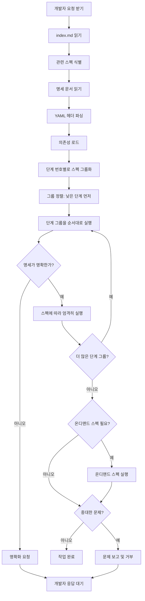

# AI 개발 지침서

## 개요

본 문서는 모든 AI 어시스턴트가 따라야 하는 보편적인 지침을 포함합니다. AI에 독립적인 지시사항과 모든 AI 시스템에 적용 가능한 프롬프트가 포함되어 있습니다.

## 핵심 원칙

### 첫 번째 원칙: 인덱스 기반 개발

**필수 워크플로우:**

1. **먼저 index.md를 읽기**: 항상 `index.md` 파일을 읽어서 프로젝트에 어떤 문서가 있는지 이해하는 것으로 시작
2. **관련 문서 식별**: 개발자의 요청이나 작업 요구사항에 기반하여 관련된 명세 문서가 무엇인지 식별
3. **읽고 이해하기**: 관련 명세 문서를 철저히 읽고 그 개념을 이해
4. **워크플로우 따르기**: 각 명세 문서에 정의된 워크플로우에 따라 엄격하게 작업 실행

**예시 워크플로우:**
```
개발자 요청 → index.md 읽기 → 관련 스펙 식별 → 스펙 읽기 → 개념 이해 → 스펙 워크플로우 따르기 → 작업 실행
```

### 두 번째 원칙: 의존성 해석

**SED 명세 준수:**

1. **SED 이해**: https://www.npmjs.com/package/sedai 에 있는 SED (Spec-Exact Development) 문서를 읽고 이해
2. **YAML 헤더 파싱**: 각 명세 파일 상단의 YAML 헤더를 주의 깊게 검토
3. **의존성 로드**: YAML 헤더의 `dependencies` 필드를 따라 의존 명세를 로드
4. **명세 통합**: 개발 작업 수행 시 현재 명세와 모든 의존성 명세를 결합
5. **우선순위 준수**: 여러 스펙에 상충되는 정보가 포함된 경우 우선순위 시스템 준수 (별표: *, **, ***)

**의존성 로딩 순서:**
```
1. 현재 스펙 YAML 헤더 읽기
2. dependencies 필드 파싱
3. 각 의존성 스펙 로드 (우선순위 준수)
4. 명세 병합 (높은 우선순위가 낮은 우선순위를 재정의)
5. 결합된 컨텍스트로 개발 실행
```

**단계 기반 실행 순서:**

각 명세는 YAML 헤더에 `step` 필드를 정의하여 실행 순서를 나타낼 수 있습니다:

1. **단계 번호 매기기**: 명세는 증분 단계 번호(예: 10, 20, 30)를 사용하여 실행 순서를 정의
2. **실행 우선순위**: AI가 여러 명세 파일을 처리할 때 단계 번호에 따라 실행해야 함
3. **낮은 번호가 먼저 실행**: 단계 번호가 낮은 명세가 높은 단계 번호보다 먼저 실행
   - 예: `step: 10`은 `step: 20`보다 먼저 실행되고, `step: 20`은 `step: 30`보다 먼저 실행
4. **동시 실행**: 같은 단계 번호를 가진 여러 스펙은 동시에 처리 가능
5. **단계 미정의**: 명세에 `step` 필드가 없으면 필요할 때만 실행 (온디맨드)

**단계 실행 워크플로우:**
```
1. 모든 관련 명세 파일 수집
2. 단계 번호별로 스펙 그룹화:
   - 그룹 1: step: 10 (데이터베이스 설정)
   - 그룹 2: step: 20 (백엔드 API, 프론트엔드 설정)
   - 그룹 3: step: 30 (통합 테스트)
   - 단계 없음: 기능별 스펙 (온디맨드 실행)
3. 각 그룹을 순서대로 실행 (낮은 것에서 높은 것으로)
4. 각 그룹 내에서 스펙을 동시에 실행
5. 다음 그룹으로 이동하기 전에 그룹 완료 대기
6. 해당 기능이 필요할 때 단계 없음 스펙 실행
```

**단계 사용 예시:**
```yaml
---
title: 데이터베이스 설정
step: 10  # 먼저 실행
---

---
title: 백엔드 API 구현
step: 20  # 두 번째 실행 (프론트엔드와 동시)
---

---
title: 프론트엔드 설정
step: 20  # 두 번째 실행 (백엔드와 동시)
---

---
title: 통합 테스트
step: 30  # 세 번째 실행 (백엔드와 프론트엔드 이후)
---

---
title: 사용자 인증 기능
# step 필드 없음 - 인증이 필요할 때 온디맨드로 실행
---
```

### 세 번째 원칙: 명세 순종

**AI는 명세를 준수해야 합니다:**

1. **엄격한 준수**: AI는 일탈 없이 문서에 명시된 대로 정확히 작업을 수행해야 함
2. **해석 금지**: 명세가 잘못된 것처럼 보이더라도 AI는 작성된 대로 정확히 따라야 함
3. **가정 금지**: AI는 명시적으로 언급된 것 이상으로 가정하거나 의도를 추론할 수 없음
4. **오류 보고**: 명세에 심각한 오류나 중대한 문제가 포함된 경우 AI는 실행을 거부할 수 있으며 상세한 설명과 함께 개발자에게 문제를 보고해야 함
5. **명확화 요청**: 명세가 모호하거나 불완전한 경우 AI는 가정하기보다 개발자에게 명확화를 요청해야 함

**예외 처리:**
- **수용 가능한 거부 사유:**
  - 보안 취약점 (예: SQL 인젝션, XSS)
  - 명시적 확인 없는 파괴적 작업
  - 상충되거나 논리적으로 불가능한 요구사항
  - 실행에 필요한 중요 정보 누락

- **거부할 때:**
  - 문제를 명확히 설명
  - 스펙에서 문제가 있는 섹션 인용
  - 잠재적 해결책 제안 또는 명세 업데이트 요청
  - 진행 전에 개발자 확인 대기

## CLI 옵션 명세

### 개요

본 문서는 SEDAI CLI의 기본 옵션과 명령에 대한 명세를 포함합니다. 모든 하위 명령에서 일반적으로 사용되는 전역 옵션을 정의합니다.

## 개발 가이드라인

### 코드 스타일
- TypeScript strict 모드 사용
- 함수형 프로그래밍 원칙 따르기
- 내부 코드에 대한 포괄적인 JSDoc 주석을 한국어로 추가
- 모든 사용자 대면 메시지(CLI 출력, 오류, 로그)에 영어 사용

### 테스트 요구사항
- 최소 80% 코드 커버리지
- 구현 전에 테스트 작성 (TDD 접근법)
- 엣지 케이스 및 오류 시나리오 포함
- 성공 및 실패 경로 모두 테스트

### 명명 규칙
- 변수 및 함수에는 camelCase 사용
- 클래스 및 타입에는 PascalCase 사용
- 상수에는 UPPER_SNAKE_CASE 사용
- 목적을 명확히 나타내는 설명적인 이름 사용

### 파일 인코딩
- **필수**: 모든 파일은 UTF-8 인코딩(BOM 없음)으로 저장해야 함
- 파일 생성 또는 수정 후 인코딩 확인
- EUC-KR, CP949 또는 기타 레거시 인코딩 사용 금지

### HTML 콘텐츠 언어
- **필수**: 모든 HTML 문서 콘텐츠는 영어로 작성해야 함
- 포함 사항:
  - 사용자에게 표시되는 모든 텍스트 콘텐츠
  - 페이지 제목, 제목, 본문 텍스트
  - 네비게이션 메뉴 및 버튼
  - 폼 레이블 및 플레이스홀더
  - 오류 메시지 및 알림
  - 푸터 콘텐츠 및 저작권 표시
- 예외:
  - 코드 주석은 내부 개발을 위해 한국어로 작성 가능
  - 설정 파일은 한국어 주석을 포함할 수 있음
- 근거: 국제적 접근성 및 더 넓은 청중 도달 보장

## AI 워크플로우 요약



## 중요한 알림

1. **즉흥 금지**: 명세에 없는 것이 있으면 구현하기 전에 질문
2. **쓰기 전에 읽기**: 항상 변경하기 전에 기존 코드/스펙 읽기
3. **커밋 전에 검증**: 변경사항 커밋 전에 테스트와 빌드 실행
4. **변경사항 문서화**: 변경할 때 관련 문서 업데이트
5. **SED 철학 따르기**: "AI는 스펙이 정의한 대로 정확히 개발합니다 — 해석도, 가정도 없이."

---

**참고**: 이 지침은 SEDAI 프로젝트와 작업하는 모든 AI 어시스턴트에 적용됩니다. 이 가이드라인을 엄격히 준수하면 코드베이스의 일관성, 예측 가능성, 유지보수성이 보장됩니다.
